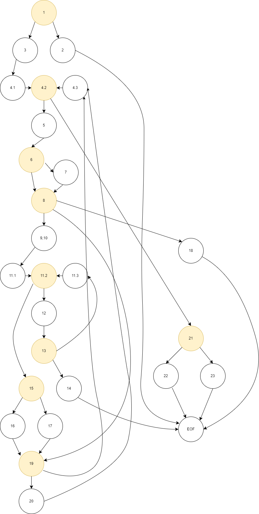
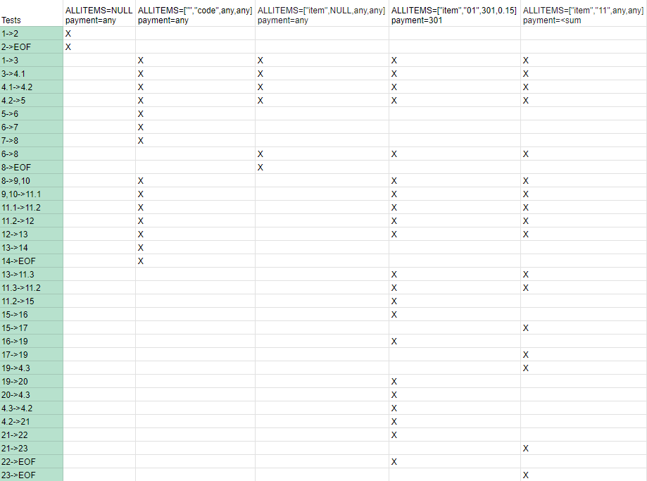

# Втора лабораториска вежба по Софтверско инженерство

## Анел Шерифи, бр. на индекс 226065

### Control Flow Graph

### Цикломатска комплексност

Цикломатската комплексност е 10.Според формулата Р+1, каде што Р е бројот на предикатни јазли. Во случајов Р=9 па цикломатската комплексност е 10.

### Тест случаи според критериумот Every Branch

#### Test 1

Ако на функцијата дадеме листа која e NULL, програмата ќе ни даде ни покаже exception за листа која е NULL

#### Test 2

Ако на функцијата дадеме листа со елемент од класата која што е празно или нема име, баркод кој има знак кој не е број и било која цена и попуст, функцијата додаде име "unknown" на item-ot и ке покаже exception за баркодот, бидејки тој има недозволен знак во баркодот

#### Test 3

Ако на функцијата дадеме листа со елемент од класата која што е празно или нема име, нема баркод(NULL) и било која цена и попуст, функцијата додаде име "unknown" на item-ot и ке покаже exception за баркодот, бидејки тој непостои

#### Test 4

Ако на функцијата дадеме листа со елемент која има име, баркод кој се состои само од броеви ,постои некоја цена и попуст, и payment која ќе биде поголем од сумата на производите, функцијата враќа вредност True

#### Test 5

Ако на функцијата дадеме листа со елемент која има име, баркод кој се состои само од броеви ,постои некоја цена и попуст, и payment која ќе биде помала од сумата на производите, функцијата враќа вредност False

### Тест случаи според критериумот Multiple Choice

if (item.getPrice() > 300 && item.getDiscount() > 0 && item.getBarcode().charAt(0)== '0)

#### IF False && ANY && ANY -> False

Ако преку функцијата на item.getPrice() добиеме вредност помала од 301, за било кои вредности кои ќе ги добиеме во останатите услови, резултатот на if statement-от е false

#### IF True && FALSE && ANY -> False

Ако преку функцијата на item.getPrice() добиеме вредност поголема од 300, но item.getDiscount() ни дава вредност помала или еднаква на 0, за било кои вредности на останатиот услов, резултатот на if statement-от е false

#### IF TRUE && TRUE && FALSE -> False

Ако преку функцијата на item.getPrice() добиеме вредност поголема од 300, item.getDiscount() ни дава вредност поголема од 0, но баркодот почнува со вредност различна од '0', if statement-от е false

#### IF TRUE && TRUE && TRUE -> TRUE

Ако преку функцијата на item.getPrice() добиеме вредност поголема од 300, item.getDiscount() ни дава вредност поголема од 0 и баркодот почнува со вредност '0', if statement-от е true
